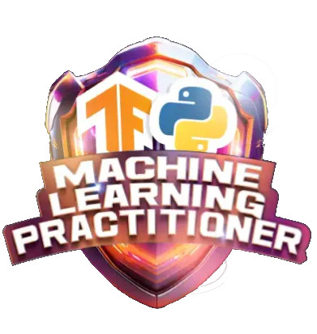

# Bootcamp BairesDev - Machine Learning Practitioner DIO

No Bootcamp BairesDev - Machine Learning Practitioner feito pela DIO e patrocinado pela BairesDev que foi realizado entre novembro e dezembro de 2024 foram abordados os seguintes assuntos:

- Python
- Introdução ao Machine Learning
- Programação para Machine Learning
- Algoritmos de Treinamento em Machine Learning
- Teoria do Aprendizado Estatístico
- Fundamentos e Práticas de Deep Learning
- Frameworks de Deep Learning
- Processamento de Imagens com Machine Learning
- Visão Computacional com Machine Learning

Neste repositório estão disponíveis os materiais de estudo do curso.
